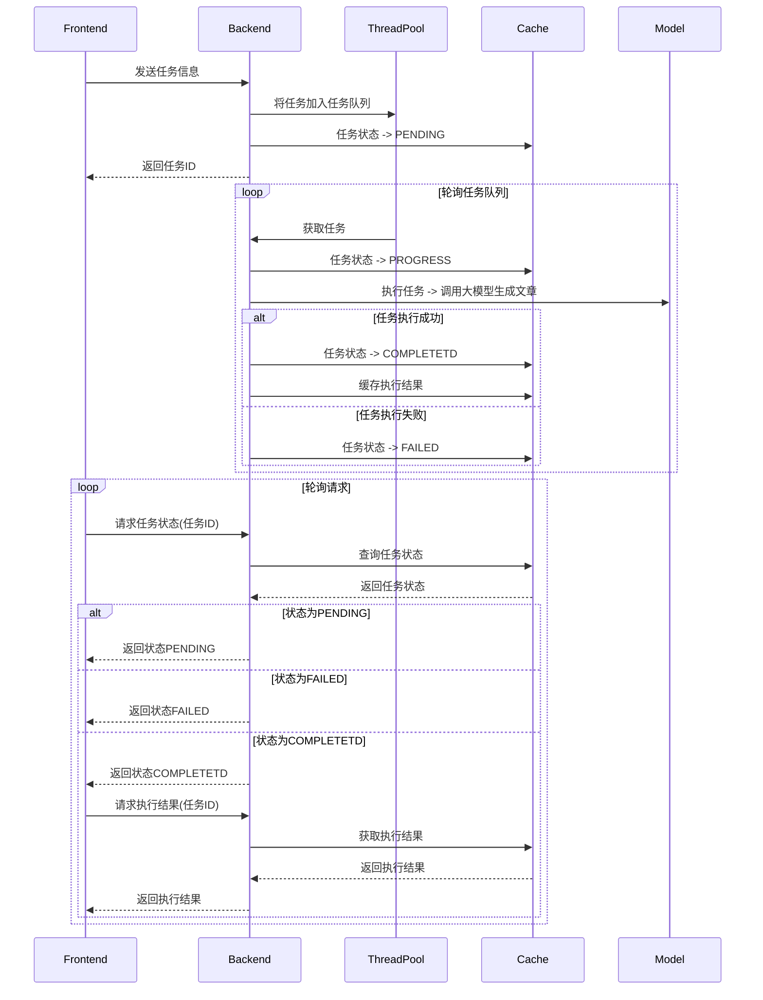

# 项目名称

Java 异步调度框架

## 项目简介

本项目是一个基于Java的异步调度框架，使用Spring Boot、Redis和线程池来处理长时间运行的任务。任务被添加到任务队列中，并立即返回任务ID以供状态查询。框架支持任务状态的更新、结果的保存和检索，以及异常处理。

## 核心功能

- **异步任务执行**：通过线程池异步执行任务。
- **任务状态管理**：使用Redis存储和更新任务状态。
- **任务结果管理**：使用Redis保存和检索任务结果。
- **回调支持**：任务完成后可执行回调操作。
- **异常处理**：任务执行过程中发生异常时进行处理。

## 关键组件

### `TaskServiceImpl`

该类是 `TaskService` 接口的核心实现，提供了异步执行任务、更新和检索任务状态以及存储和检索任务结果的方法。

### 主要组件:

- `ThreadPoolTaskExecutor`：管理执行任务的线程池。
- `RedisTemplate`：用于与 Redis 交互，存储任务状态和结果。
- `TaskExecutor`：执行实际任务逻辑的接口。
- `TaskCallback`：处理任务完成的接口。
- `TaskExHandler`：处理任务执行异常的接口。

### 方法:

1. **asyncExecute(T params)**:
   - 生成唯一的任务 ID。
   - 将任务状态更新为 `PENDING`（排队中）。
   - 异步执行任务。
   - 执行过程中将任务状态更新为 `IN_PROGRESS`（进行中）。
   - 完成后将任务状态更新为 `COMPLETED`（完成），并保存结果。
   - 失败时将任务状态更新为 `FAILED`（失败），并调用异常处理器。
2. **updateStatus(String taskId, TaskStatus status)**:
   - 更新 Redis 中任务的状态。
3. **getStatus(String taskId)**:
   - 从 Redis 中检索任务的状态。
4. **getStatusMap(List<String> taskIdList)**:
   - 从 Redis 中检索多个任务的状态。
5. **getAllStatus()**:
   - 从 Redis 中检索所有任务的状态。
6. **saveResult(String taskId, Object result)**:
   - 将任务的结果保存到 Redis。
7. **getResult(String taskId, Class<R> clazz)**:
   - 从 Redis 中检索任务的结果。
8. **getResultMap(List<String> taskIdList, Class<R> clazz)**:
   - 从 Redis 中检索多个任务的结果。

## 实现原理



## 使用方法

要使用此框架，请实现 `TaskExecutor`、`TaskCallback` 和 `TaskExHandler` 接口，并配置 Spring Boot 应用程序中的 `ThreadPoolTaskExecutor` 和 `RedisTemplate` bean。使用这些组件实例化 `TaskServiceImpl`，并使用它来异步执行任务。

## 示例

```java
@Service
public class MyTaskExecutor implements TaskExecutor<MyParams, MyResult> {
    @Override
    public MyResult execute(MyParams params) {
        // 任务执行逻辑
    }
}

@Service
public class MyTaskCallback implements TaskCallback<MyResult> {
    @Override
    public void onComplete(MyResult result) {
        // 任务完成逻辑
    }
}

@Service
public class MyTaskExceptionHandler implements TaskExHandler<MyParams> {
    @Override
    public void onFailure(Throwable throwable) {
        // 任务异常处理逻辑
    }
}

@Configuration
public class AppConfig {
    @Bean
    public ThreadPoolTaskExecutor threadPoolTaskExecutor() {
        // 配置 ThreadPoolTaskExecutor
    }

    @Bean
    public RedisTemplate redisTemplate() {
        // 配置 RedisTemplate
    }

    @Bean
    public TaskService<MyParams, MyResult> taskService(ThreadPoolTaskExecutor threadPoolTaskExecutor, RedisTemplate redisTemplate, TaskExecutor<MyParams, MyResult> taskExecutor, TaskCallback<MyResult> taskCallback, TaskExHandler<MyParams> taskExceptionHandler) {
        return new TaskServiceImpl<>(threadPoolTaskExecutor, redisTemplate, taskExecutor, taskCallback, taskExceptionHandler);
    }
}
```

